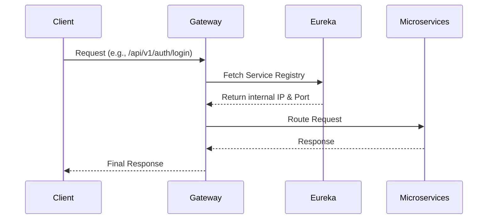

# 🚪 API Gateway

The API Gateway is the central entry point for all client requests in the CoderRide ecosystem. It is built using **Spring Cloud Gateway**.

## 🏗️ Architecture Flow

## 🔑 Key Responsibilities
- **Dynamic Routing**: Maps incoming paths (e.g., `/api/v1/projects/**`) to the correct backend microservice.
- **Load Balancing**: Distributes traffic across multiple instances of a service.
- **Security & CORS**: Centralized CORS configuration and potential JWT validation before routing.
- **Rate Limiting**: (Future scope) Preventing API abuse.

## ⚙️ Configuration
The gateway heavily relies on Eureka for service discovery.
- **Port**: `8080`
- **Application Name**: `api-gateway`
